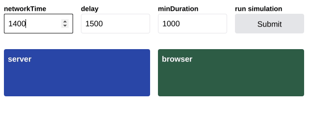

# spin-delay

<!-- ALL-CONTRIBUTORS-BADGE:START - Do not remove or modify this section -->
[](#contributors-)
<!-- ALL-CONTRIBUTORS-BADGE:END -->

**Smart Spinner Helper for React**



There are a few annoyances when working with spinners. Network request can be so
fast that rendering a spinner does more harm than good. Why render a spinner
when loading the data only takes like 50ms?

This can be fixed by adding a delay. Only show the spinner when the request takes
longer than 200ms for example. And what happens when the request takes 210ms? Right,
we see a spinner for 10ms. This flicker can be annoying.

`spin-delay` solves these issues by wrapping your booleans, and only returning
true after the `delay`, and for a minimum time of `minDuration`. This way
you're sure that you don't show unnecessary or very short living spinners.

## Demo

Sandbox -> https://codesandbox.io/s/spin-delay-jlp2c

## Installation

With npm:

```sh
npm install --save spin-delay
```

With yarn:

```sh
yarn add spin-delay
```

## API

The examples below use the following data object:

```jsx
import { useSpinDelay } from 'spin-delay';

function MyComponent() {
  const [{ loading }] = useFetch('http://example.com');

  // options are optional, and default to these values
  const showSpinner = useSpinDelay(loading, { delay: 500, minDuration: 200 });

  if (showSpinner) {
    return <Spinner />;
  }

  // ...
}
```

## Contributors ✨

Thanks goes to these wonderful people ([emoji key](https://allcontributors.org/docs/en/emoji-key)):

<!-- ALL-CONTRIBUTORS-LIST:START - Do not remove or modify this section -->
<!-- prettier-ignore-start -->
<!-- markdownlint-disable -->
<table>
  <tbody>
    <tr>
      <td align="center" valign="top" width="14.28%"><a href="https://github.com/smeijer"><br /><sub><b>Stephan Meijer</b></sub></a><br /><a href="#ideas-smeijer" title="Ideas, Planning, & Feedback">🤔</a> <a href="https://github.com/smeijer/spin-delay/commits?author=smeijer" title="Code">💻</a> <a href="#infra-smeijer" title="Infrastructure (Hosting, Build-Tools, etc)">🚇</a> <a href="#maintenance-smeijer" title="Maintenance">🚧</a> <a href="https://github.com/smeijer/spin-delay/commits?author=smeijer" title="Tests">⚠️</a></td>
      <td align="center" valign="top" width="14.28%"><a href="http://peter.hozak.info/"><br /><sub><b>Peter Hozák</b></sub></a><br /><a href="#ideas-Aprillion" title="Ideas, Planning, & Feedback">🤔</a> <a href="https://github.com/smeijer/spin-delay/commits?author=Aprillion" title="Tests">⚠️</a></td>
      <td align="center" valign="top" width="14.28%"><a href="http://www.erichosick.com/"><br /><sub><b>Eric Hosick</b></sub></a><br /><a href="https://github.com/smeijer/spin-delay/commits?author=erichosick" title="Documentation">📖</a></td>
      <td align="center" valign="top" width="14.28%"><a href="https://github.com/supachaidev"><br /><sub><b>Supachai Dev</b></sub></a><br /><a href="https://github.com/smeijer/spin-delay/commits?author=supachaidev" title="Code">💻</a></td>
      <td align="center" valign="top" width="14.28%"><a href="https://kentcdodds.com/"><br /><sub><b>Kent C. Dodds</b></sub></a><br /><a href="https://github.com/smeijer/spin-delay/commits?author=kentcdodds" title="Code">💻</a></td>
      <td align="center" valign="top" width="14.28%"><a href="https://github.com/chucamphong"><br /><sub><b>Phong Chu</b></sub></a><br /><a href="https://github.com/smeijer/spin-delay/commits?author=chucamphong" title="Code">💻</a></td>
      <td align="center" valign="top" width="14.28%"><a href="https://github.com/joeporpeglia"><br /><sub><b>Joe Porpeglia</b></sub></a><br /><a href="https://github.com/smeijer/spin-delay/commits?author=joeporpeglia" title="Code">💻</a></td>
    </tr>
  </tbody>
</table>

<!-- markdownlint-restore -->
<!-- prettier-ignore-end -->

<!-- ALL-CONTRIBUTORS-LIST:END -->

This project follows the [all-contributors](https://github.com/all-contributors/all-contributors) specification. Contributions of any kind welcome!
